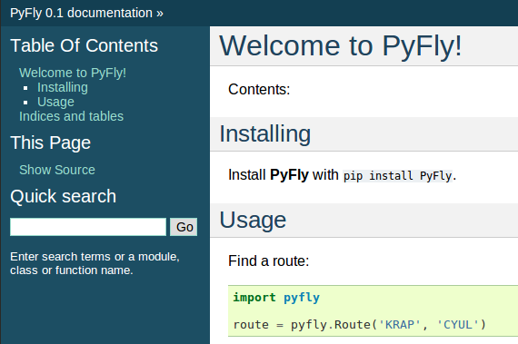

:title: Set your code free: releasing and maintaining a Python project
:author: Carl Meyer
:description: a presentation for PyCon 2014
:keywords: presentation, python, pycon

:skip-help: true
:data-transition-duration: 400

----

:id: title

set your code free
==================

releasing and maintaining an open-source Python library
-------------------------------------------------------

|hcard|

.. note::

   * Hi! Welcome to the final talks session of PyCon
   * I know it's been a long conference
   * I'll at least keep this short
   * If I'm lucky also keep you awake
   * and send you off on a high note, inspired to release your own software!

----

:data-reveal: 1

You have *code!*
----------------

* You want me to *use* it (``pip install``).

* You want me to *contribute* to it.

.. note::

   * The premise of this talk is that you have some code.
   * Writing that code is out of scope.
   * --
   * ``pip install``
   * not web app deployment or GUI installer
   * --
   * "accept my contributions without breaking your software or losing your
     sanity"
   * So you look up the docs on how to do this...

----

:data-center: 1

.. image:: images/confused-traffic-sign.jpg
   :height: 700px

.. note::

   * ...and you find lots of different projects
   * all with their own documentation to read
   * When you're doing something for the first time, choices kill.
   * This talk presents a set of rails for setting up your first open-source
     project..
   * It's not the only way, but _a_ way that will work.
   * Long on opinions, short on choices.
   * "From zero to awesome in 20 minutes."
   * The awesome:
   * public HTML docs with built-in navigation that update when you push
   * tests that run on every push (and on pull requests)
   * ``pip install`` ready
   * welcoming to contributors.
   * If you've done this before, hopefully you'll still pick up a new trick or
     two.

----

:data-reveal: 1

All the things
--------------

#. Project structure.

#. Choosing a license.

#. Code hosting.

#. Documentation.

#. Testing & CI.

#. Packaging.

#. Community.

.. note::

   The roadmap for this talk.

----

:data-emphasize-lines-step: 2,3,4,5,6,7,8,9

*01.* Structure
---------------

.. code::
   :number-lines:

    .
    └── PyFly/
        ├── docs/
        ├── pyfly/
        │   └── __init__.py
        ├── tests/
        ├── LICENSE.txt
        ├── README.rst
        └── setup.py

.. note::

   * This is the bare bones
   * We'll flesh this out and add to it as we go.

----

:data-reveal: 1

*02.* License
-------------

* The **conditions** for my use.

* **No license** means **I can't use it**.

* If you aren't sure, use `BSD`_ or `MIT`_.

* Or (L) `GPL`_, `Apache`_, `MPL`_.

* Don't use anything else.

* H/t: `@jacobian`_ 's `lightning talk`_.

.. note::

   * First decision: releasing software as open source means choosing a
     license.
   * I am not a lawyer, this is not legal advice.
   * --
   * Your license is the conditions under which I can use your code.
   * --
   * If you don't have a license, the default is "all rights reserved."
   * A project without a license is not open-source, even if its on GitHub!
   * --
   * BSD or MIT are unrestrictive licenses;
   * All you ask from your users is that they credit you: keep your name and
     the license attached to your work.
   * --
   * GPL is more restrictive; requires that any work derived from yours must
     also be released as GPL. If you're worried about freeloaders, you can go
     this route, at the cost of having fewer users.
   * Apache and MPL are reasonable choices if you know why you're choosing
     them.
   * --

----

:id: license

``LICENSE.txt``
---------------

.. code::
   :number-lines:

    Copyright (c) 2009-2014, Carl Meyer and contributors
    All rights reserved.

    Redistribution and use in source and binary forms, with or without
    modification, are permitted provided that the following conditions are
    met:

        * Redistributions of source code must retain the above copyright
          notice, this list of conditions and the following disclaimer.
        * Redistributions in binary form must reproduce the above
          copyright notice, this list of conditions and the following
          disclaimer in the documentation and/or other materials provided
          with the distribution.

    THIS SOFTWARE IS PROVIDED BY THE COPYRIGHT HOLDERS AND CONTRIBUTORS
    "AS IS" AND ANY EXPRESS OR IMPLIED WARRANTIES, INCLUDING, BUT NOT
    LIMITED TO, THE IMPLIED WARRANTIES OF MERCHANTABILITY AND FITNESS FOR
    A PARTICULAR PURPOSE ARE DISCLAIMED. IN NO EVENT SHALL THE COPYRIGHT
    OWNER OR CONTRIBUTORS BE LIABLE FOR ANY DIRECT, INDIRECT, INCIDENTAL,
    SPECIAL, EXEMPLARY, OR CONSEQUENTIAL DAMAGES (INCLUDING, BUT NOT
    LIMITED TO, PROCUREMENT OF SUBSTITUTE GOODS OR SERVICES; LOSS OF USE,
    DATA, OR PROFITS; OR BUSINESS INTERRUPTION) HOWEVER CAUSED AND ON ANY
    THEORY OF LIABILITY, WHETHER IN CONTRACT, STRICT LIABILITY, OR TORT
    (INCLUDING NEGLIGENCE OR OTHERWISE) ARISING IN ANY WAY OUT OF THE USE
    OF THIS SOFTWARE, EVEN IF ADVISED OF THE POSSIBILITY OF SUCH DAMAGE.

----

:data-reveal: 1

*03.* Code hosting
------------------

* `GitHub`_.

* That's where the people are.

.. note::

   * We have a lot of areas to cover,
   * --
   * so fortunately some are short and sweet.

----

:data-reveal: 1

*04.* Docs
----------

* If it's not documented, it doesn't exist.

* Build it with `Sphinx`_.

* Host it at `ReadTheDocs`_.

.. note::

   * --
   * I like reading code. I will read code to find a bug, to fix a bug, or to
     better understand how your library does what it does.
   * But if I have to read your code to figure out how to use your thing -- I'm
     gonna choose a different library, or just write it myself instead.
   * Auto-generated API docs don't count, unless your API is very simple. A
     long list of functions and classes with their docstrings is something I
     can get from reading your code.
   * How to write your docs: fortunately another easy choice.
   * --
   * And so is where to host it.
   * The combination of Sphinx and Read The Docs makes it so ridiculously easy
     to put beautiful, usable docs online, it's a shame not to take advantage
     of that by writing some!

----

:data-emphasize-lines-step: 1,4,6,10,12

.. code::
   :number-lines:

   $ pip install sphinx
   ...

   $ cd docs/

   $ sphinx-quickstart
   ...

   Enter the root path for documentation.
   > Root path for the documentation [.]:

   ...

.. note::

   * You can write some sphinx docs in about as much time as I'll spend on the
     next two slides.
   * --
   * pip install sphinx
   * --
   * switch to the docs directory
   * --
   * run 'sphinx-quickstart'
   * --
   * answer some questions; the defaults will do

----

:data-emphasize-lines-step: 1,2,3,4,5,6,10

``docs/index.rst``
------------------

.. code:: rst
   :number-lines:

   Welcome to PyFly!
   =================
   Installing
   ----------
   Install **PyFly** with
   ``pip install PyFly``.

   Usage
   -----
   .. code::

      import pyfly
      route = pyfly.Route('KRAP', 'CYUL')

* If you haven't written restructuredtext, the basics are very easy.
* --
* underlined headers
* --
* different levels of headers
* --
* inline formatting: strong with double asterisk
* --
* inline code literals
* --
* code blocks, automatically syntax highlighted in pretty much any language
* If you take five minutes and write exactly this much documentation -- a
  simple usage example -- you've already made your package much more attractive
  than one without docs.

----

``make html``
-------------

.. note::

   * Run 'make html' to generate an HTML version of your docs

----

:data-center: 1
:data-fullwidth: 1

----

:id: rtd
:data-fullwidth: 1
:data-center: 1

----

:data-fullwidth: 1
:data-center: 1

.. image:: images/rtd-docs.png
   :width: 1000px

.. note::

   * Automatically updates the docs every time you push to the repo.

   * Can build multiple different versions (by branch or tag) and provides a
     version switcher to choose between them.

   * Good-looking, mobile-responsive theme.

   * Win!

----

:data-reveal: 1

*05.* Testing
-------------

* If it's not tested, it's broken.

.. note::

   Tests are good for any code, but they are critical for open-source code that
   is getting contributions.

   Finding time to handle pull requests is hard enough, you really don't want
   to have to run through a bunch of manual tests for every pull request to
   verify that it didn't break things.

----

:id: matrix

================ === === === === ===
Versions                Python
---------------- -------------------
Django           2.6 2.7 3.2 3.3 3.4
================ === === === === ===
**1.4.10**
**1.5.5**
**1.6.2**
**1.7-alpha**
**master**
================ === === === === ===

.. note::

   A reasonable support matrix for a popular Django add-on library.

   Could be worse: with another dependency or two it would have 3 or 4
   dimensions, not just 2.

   25 boxes in that matrix. Are you gonna create 25 virtualenvs and run the
   tests 25 times for every pull request to your project? If not, your claim to
   support all those versions is purely theoretical, and almost certainly not
   true.

   Thankfully, there's a tool to help with this: ...

----

:data-reveal: 1

`tox`_ saves the day
====================

* Creates a bunch of virtualenvs.

* Runs your tests in each of them.

.. note::

   One command.

----

:data-emphasize-lines-step: 2,5,6

``tox.ini``
-----------

.. code:: ini
   :number-lines:

   [tox]
   envlist = py27,py33

   [testenv]
   deps = pytest
   commands = py.test

.. note::

   A very simple tox setup.

----

:id: running-tox
:data-small-code: 1
:data-emphasize-lines-step: 1,2,3,4,5,6,11,15,18,19,20
:data-pytest-highlight: 1

.. code::
   :number-lines:

   $ tox
   GLOB sdist-make: /.../PyFly/setup.py
   py27 create: /.../PyFly/.tox/py27
   py27 installdeps: pytest
   py27 inst: /.../PyFly/.tox/dist/PyFly-0.1.zip
   py27 runtests: commands[0] | py.test
   ================== test session starts ====================
   platform linux -- Python 2.7.6 -- py-1.4.20 -- pytest-2.5.2
   collected 3 items

   test_routes.py ...

   ================== 3 passed in 0.02 seconds ===============

   ... <same for py33>...

   __________________ summary ________________________________
     py27: commands succeeded
     py33: commands succeeded
     congratulations :)

----

:id: complex-tox
:data-small-code: 1
:data-emphasize-lines-step: 3,13,14,16,17

.. code:: ini
   :number-lines:

   [tox]
   envlist =
       py27-1.4, py27-1.5, py27-1.6, py27-trunk,
       py32-1.5, py32-1.6, py32-trunk,
       py33-1.5, py33-1.6, py33-trunk

   [testenv]
   deps =
       South == 0.8.1
       coverage == 3.6
   commands = coverage run -a setup.py test

   [testenv:py27-1.4]
   basepython = python2.7
   deps =
       Django == 1.4.10
       {[base]deps}

   ... <same for each env> ...

.. note::

   A more complex example.

   Gets a bit verbose with a lot of envs, but still loads better than doing it
   manually!

----

:id: all-the-time
:data-center: 1

*Running your tests*
====================

all the time
============

.. note::

   You get a pull request, you open a terminal, you add the source of the PR as
   a remote, you pull their branch, you run tox... wouldn't it be nice if when
   you first looked at the pull request, it already told you whether the tests
   passed or not?

   This used to be hard. Today it is easy.

----

travis-ci.org
-------------

.. note::

   Will do this for free for public GitHub projects.

   (There's also drone.io and probably others; Travis is the one I've used.)

----

:data-fullwidth: 1
:data-center: 1

----

:data-emphasize-lines-step: 1,3,8

``.travis.yml``
---------------

.. code:: yaml
   :number-lines:

    language: python

    python:
      - 3.2
      - 3.3
      - 3.4

    script:
      - py.test

----

:id: travis-complex
:data-small-code: 1
:data-emphasize-lines-step: 6,10,14,15,17,22

.. code:: yaml
   :number-lines:

    language: python
    python:
      - 2.7
      - 3.3
      - 3.4
    env:
      - DJANGO=Django==1.4.10
      - DJANGO=Django==1.5.5
      - DJANGO=Django==1.6.1
    install:
      - pip install $DJANGO
      - pip install coverage coveralls
    script:
      - coverage run -a setup.py test
      - coverage report
    matrix:
      exclude:
       - python: 3.3
         env: DJANGO=Django==1.4.10
       - python: 3.4
         env: DJANGO=Django==1.4.10
    after_success: coveralls

.. note::

   Can also reuse your tox environments in .travis.yml via TOXENV. Or translate
   tox.ini to .travis.yml and vice versa using panci.

   I just maintain them both manually, they don't change that often.

----

:id: travis-results
:data-reveal: 1
:data-fullwidth: 1
:data-center: 1

.. image:: images/travis-results.png
   :height: 750px

.. image:: images/travis-github.png

----

*06.* Packaging
---------------

.. note::

   Oh yes, you may want people to be able to install your thing!

----

``setup.py``
------------

----

:id: setup-py
:data-small-code: 1
:data-emphasize-lines-step: 1,3,4,6,7,8,9,10,11,12,13,14,15,16

.. code:: python
   :number-lines:

    from setuptools import setup

    with open('README.rst') as fh:
        long_description = fh.read()

    setup(
        name='PyFly',
        version='0.1.2',
        description='Flying with Python',
        long_description=long_description,
        author='Carl Meyer',
        author_email='carl@oddbird.net',
        url='https://github.com/oddbird/PyFly/',
        packages=['pyfly'],
        install_requires=['six'],
        classifiers=[
            'Development Status :: 3 - Alpha',
            'License :: OSI Approved :: BSD License',
            'Programming Language :: Python',
            'Programming Language :: Python :: 2.7',
            'Programming Language :: Python :: 3',
            'Programming Language :: Python :: 3.3',
            'Programming Language :: Python :: 3.4',
        ],
    )

----

:data-reveal: 1

* ``python setup.py sdist``

* ``pip install dist/PyFly-0.1.2.tar.gz``

* ``python setup.py register sdist upload``

* ``pip install PyFly``

* Win!

----

:id: pug
:data-reveal: 1

For more
========

* `Python Packaging User Guide`_

* `python-packaging-user-guide.readthedocs.org`_

----

*07.* Community
---------------

.. note::

   Ways you can create a happier experience for people using and contributing
   to your software.

----

:id: semver
:data-reveal: 1

Semantic Versioning
-------------------

* X.Y.Z

* increment:

* *X* for breaking changes.

* *Y* for backwards-compatible feature additions.

* *Z* for bug fixes.

* `semver.org`_

----

Keep a *changelog*
==================

----

:id: changes
:data-small-code: 1

``CHANGES.rst``
===============

.. code:: rst

    CHANGES
    =======

    master (unreleased)
    -------------------

    2.0.3 (2014.03.19)
    -------------------

    * Fix ``get_query_set`` vs ``get_queryset``
      in ``PassThroughManager`` for Django <1.6.
      Thanks whop, Bojan Mihelac, Daniel Shapiro,
      and Matthew Schinckel for the report;
      Matthew for the fix. Merge of GH-121.

    * Fix ``FieldTracker`` with deferred model
      attributes. Thanks Michael van Tellingen.
      Merge of GH-115.

.. note::

   Changes relevant to users.

   NOT the same as a git commit log.

----

Have a *CONTRIBUTING* document
------------------------------

----

:id: contributing
:data-reveal: 1

``CONTRIBUTING.rst``
====================

* How to get set up for development.

* How to run the tests.

* What to include in a bug report.

* Coding standards, test coverage standards...

* |github-contrib|

.. |github-contrib| image:: images/github-contributing.png
                    :width: 800px

----

:data-center: 1

Keep the
========

*tests passing*
===============

----

:data-center: 1

Give
====

*quick feedback*
================

----

Give *credit*
=============

----

Be *nice*
=========

----

:id: questions

Questions?
==========

`oddbird.net/set-your-code-free-preso`_

|hcard|

.. |hcard| raw:: html

   

   
   <h3 class="fn">Carl Meyer</h3>
   <ul class="links">
     <li><a href="http://www.oddbird.net" class="org url">oddbird.net</a></li>
     <li><a href="https://twitter.com/carljm" rel="me">@carljm</a></li>
   </ul>
   

.. _oddbird.net/set-your-code-free-preso: http://oddbird.net/set-your-code-free-preso
.. _BSD: http://opensource.org/licenses/BSD-3-Clause
.. _MIT: http://opensource.org/licenses/MIT
.. _GPL: http://opensource.org/licenses/gpl-license
.. _Apache: http://opensource.org/licenses/Apache-2.0
.. _MPL: http://opensource.org/licenses/MPL-2.0
.. _@jacobian: https://twitter.com/jacobian
.. _lightning talk: http://www.youtube.com/watch?v=vhuF0oalOi8
.. _GitHub: https://github.com/
.. _Sphinx: http://sphinx-doc.org/
.. _ReadTheDocs: https://readthedocs.org/
.. _tox: http://tox.readthedocs.org/en/latest/
.. _semver.org: http://semver.org
.. _Python Packaging User Guide: http://python-packaging-user-guide.readthedocs.org/en/latest/
.. _python-packaging-user-guide.readthedocs.org: http://python-packaging-user-guide.readthedocs.org/en/latest/
